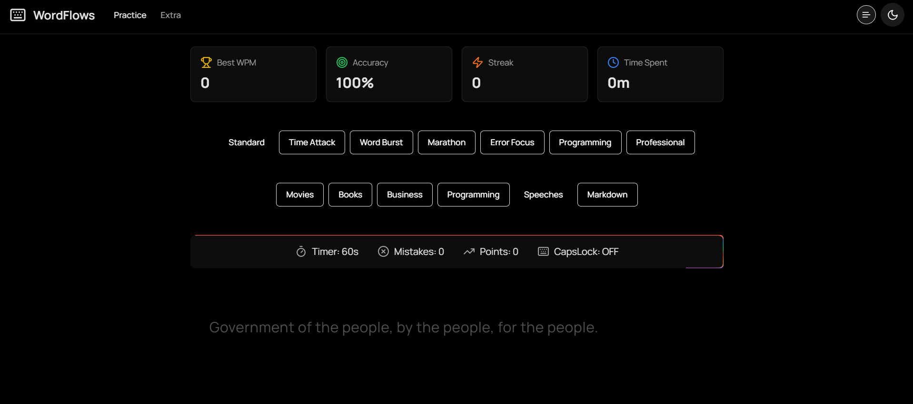

<div align="center">
  
# ⌨️ WordFlows

[](https://opensource.org/licenses/MIT)
[](https://nextjs.org/)
[](https://www.typescriptlang.org/)
[](https://tailwindcss.com/)

**Master Your Typing Skills with Style**

[Live Demo](https://wordflows.netlify.app/) | [Report Bug](https://github.com/Saoud30/WordFlows/issues) | [Request Feature](https://github.com/Saoud30/WordFlows/issues)

<div align="center">
  
</div>

</div>

## ✨ Features

- 🎯 Multiple Practice Modes
  - Standard Mode
  - Time Attack
  - Word Burst
  - Marathon
  - Error Focus
  - Programming
  - Professional

- 📚 Diverse Content Categories
  - Movie Quotes
  - Book Excerpts
  - Famous Speeches
  - Programming Snippets
  - Business Writing
  - Markdown Practice

- 🎨 Beautiful UI/UX
  - Dark Mode Support
  - Real-time Stats
  - Animated Borders
  - Progress Tracking
  - Interactive Elements

- 📊 Performance Metrics
  - Words Per Minute (WPM)
  - Accuracy Tracking
  - Mistake Counter
  - Personal Best Records
  - Streaks System

## 🚀 Quick Start

```bash
# Clone the repository
git clone https://github.com/Saoud30/WordFlows.git

# Navigate to project directory
cd wordflows

# Install dependencies
npm install

# Start development server
npm run dev
```

## 🛠️ Built With

- [Next.js 13](https://nextjs.org/) - React Framework
- [TypeScript](https://www.typescriptlang.org/) - Type Safety
- [Tailwind CSS](https://tailwindcss.com/) - Styling
- [Zustand](https://zustand-demo.pmnd.rs/) - State Management
- [Lucide Icons](https://lucide.dev/) - Icons
- [shadcn/ui](https://ui.shadcn.com/) - UI Components

## 📖 Usage

1. **Select Your Mode**
   - Choose from various typing modes based on your goal

2. **Pick a Category**
   - Select content that interests you

3. **Choose Length**
   - Short (1-2 lines)
   - Medium (3-5 lines)
   - Long (Full documents)

4. **Start Typing**
   - Real-time feedback
   - Track your WPM
   - Monitor accuracy

## 🎮 Game Modes

| Mode | Description |
|------|-------------|
| Standard | Classic typing test with 60-second limit |
| Time Attack | Race against time with 30-second limit |
| Word Burst | Quick 15-second sprints |
| Marathon | Extended 5-minute sessions |
| Error Focus | Practice problematic characters |
| Programming | Code snippet typing practice |
| Professional | Business writing practice |

## 🤝 Contributing

1. Fork the Project
2. Create your Feature Branch (`git checkout -b feature/AmazingFeature`)
3. Commit your Changes (`git commit -m 'Add some AmazingFeature'`)
4. Push to the Branch (`git push origin feature/AmazingFeature`)
5. Open a Pull Request

## 📝 License

Distributed under the MIT License. See `LICENSE` for more information.

## 👤 Contact

Saoud30 - [@Saoud30](https://github.com/Saoud30)

Project Link: [https://github.com/Saoud30/wordflows](https://github.com/Saoud30/wordflows)

## 🌟 Acknowledgments

- [Next.js Documentation](https://nextjs.org/docs)
- [Tailwind CSS](https://tailwindcss.com/)
- [shadcn/ui Components](https://ui.shadcn.com/)
- [Lucide Icons](https://lucide.dev/)

---

<div align="center">
  
Made with ❤️ by [Saoud30](https://github.com/Saoud30)

⭐️ Star this project if you find it helpful!

</div>
<div align="center">

**"The key is not to prioritize what's on your schedule, but to schedule your priorities." - Stephen Covey. Keep practicing and make typing a priority!**

</div>